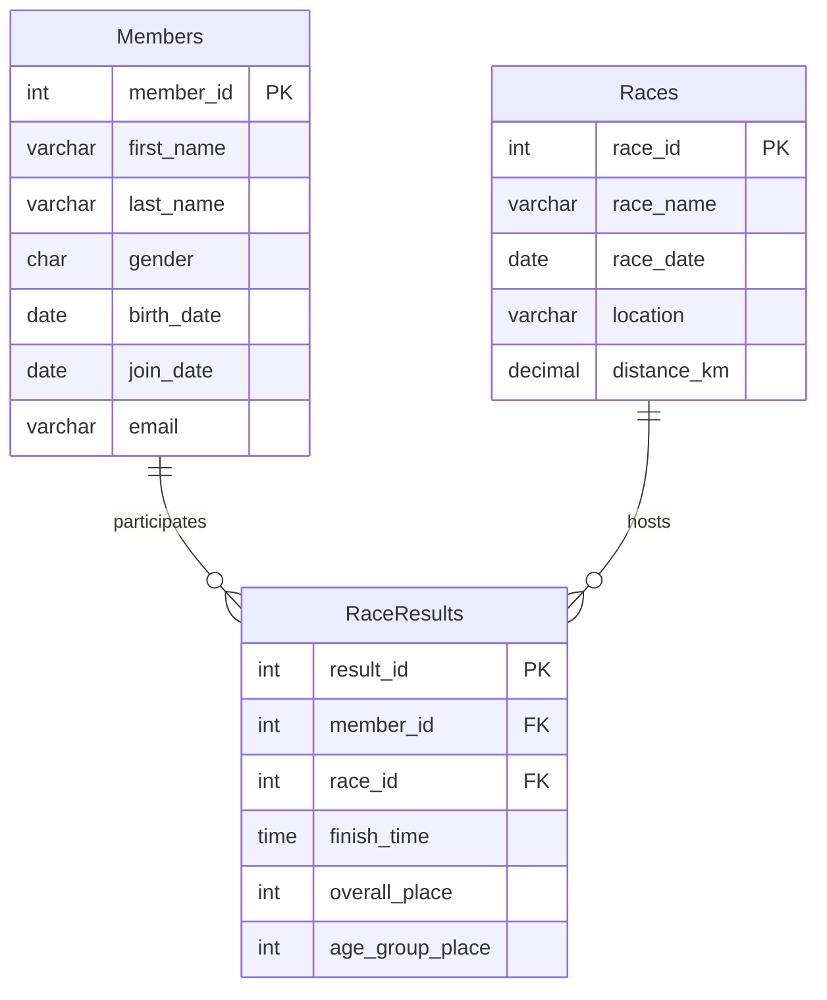

# CS415 Database Project 
# Greenwood Road Runners 

---

## Database Summary Report 

### Project Overview

My Organization is called The Greenwood Road Runners and they are a racing club based in Greenwood, Indiana. They were founded in 2019 and the club currently has 60 active members which range from ages 23 to 60. As of right now the club participates in 20-25 organized races per year. Two of which we host which are the Turkey Trot 5k and the Spring Classic Half Marathon. The President of the club, race director,Membership coordinators, and volunteer timers will handle all the planning, registration and keeping the records in the database. 
    
Our mission as an organization is to promote Health and pushing yourself 1% better everyday. Our Modo is Go One More, which incourages everyone to push past their limits to sucseed. We are inclusive so anyone, any age can join. We still celebrate competetive success through different age groups and club records. This database can give you the average 5k time for runners in their 30's or even top 10 5k times. while also looking back at ones history in races and seeing how much they have improved.

### Users View
From a Users point of view, this database is a single source for everything related to the Club, whether racing or registration. Members and staff can pull up an alphabetical member dirrectory instantly and see every race that has been completed. This will have everything the club has entered including dates, locations, and distances. Also including ones indivitual time, overall place and age group. In one of my quiries Emily Johnson can run it and it will output her race history in chronological order. Another query you can is the 5k leaderboard, so that you can see how fast you need to run in order to make it up their.

Staff will use the database daily. Some examples include the Membership coordinators, Timers, and President. The Membership coordinators can identify members who have not attempted a half marathon and encourage those to compete. While the Timers take a look at it after every event and can determine whose ran the fastedt out of a specific year to crown the fastest. They can also crown who has ran the fastest 5k fro the year. The President could track what months have the highest sign up rate in order to determine when to schedule new races. if an error is made in the timing portion and it says you ran 20 seconds too slow, thats no problem. A single UPDATE statment can correct that and fix your time. If A runner gets injured after being added to a race the ROLLBACK call can undo their entry.

---

## Database ER Model



### Database Design Description

The database for the Greenwood Road Runners is built around three normalized entities: `Members` , `Races` , and `RaceResults`. Each table stores a focused set of information. Members represent individuals in the running club; races represent official events the club participates in or hosts; race results link the two together. Keeping these entities separate avoids repeating information and makes the structure easier to maintain.

During normalization, one major decision was not to copy member names or race names into the RaceResults table. Instead, the RaceResults table stores only foreign keys (member_id, race_id) along with performance-specific details, such as finish time and placements. This prevents update anomalies—for example, a member updating their last name should only update one row, not hundreds. All fields in each table depend only on the primary key, meaning the design satisfies 3rd Normal Form.

Another design choice was to keep race distance and race date directly in the Races table, rather than breaking them into lookup tables. Since the club works with a manageable number of events each year, keeping race information in a single table is practical and easy for new database users to understand. If needed in the future, this could be expanded to include course difficulty, terrain type, or certification status.

`Members`
The Members table stores personal and contact information for each club member. It acts as the source of truth for names, demographics, and join dates. All race performances must connect back to a member stored in this table.

`Races`
The Races table represents each official running event. It contains the race name, date, location, and distance. This table allows staff to track the club’s race calendar and view which events members have completed.

`RaceResults`
The RaceResults table records each member’s performance in a specific race. It stores the finish time, overall placement, and age-group placement. This table is essential for club reporting, including leaderboards, personal records, and historical performance analysis.

---

### Create Tables 

The following SQL creates the `Members` , `Races` , and `RaceResults` tables in the current database. Note that it does not create a database, only the tables.

```sql

-- -----------------------------------------------------
-- Table `Members`
-- Stores people who participate/registers
-- -----------------------------------------------------
CREATE TABLE IF NOT EXISTS `Members` (
  `member_id`   INT NOT NULL AUTO_INCREMENT,
  `first_name`  VARCHAR(50) NOT NULL,
  `last_name`   VARCHAR(50) NOT NULL,
  `gender`      ENUM('M','F','X') NOT NULL,
  `birth_date`  DATE NOT NULL,
  `join_date`   DATE NOT NULL,
  `email`       VARCHAR(100) DEFAULT NULL,
  PRIMARY KEY (`member_id`),
  KEY `idx_member_name` (`last_name`,`first_name`)
) ENGINE=InnoDB AUTO_INCREMENT=61 DEFAULT CHARSET=latin1;

-- -----------------------------------------------------
-- Table `Races`
-- Stores Race Info
-- -----------------------------------------------------
CREATE TABLE IF NOT EXISTS `Races` (
  `race_id`     INT NOT NULL AUTO_INCREMENT,
  `race_name`   VARCHAR(100) NOT NULL,
  `race_date`   DATE NOT NULL,
  `location`    VARCHAR(80) NOT NULL,
  `distance_km` DECIMAL(4,2) NOT NULL,
  PRIMARY KEY (`race_id`),
  KEY `idx_race_date` (`race_date`)
) ENGINE=InnoDB AUTO_INCREMENT=26 DEFAULT CHARSET=latin1;

-- -----------------------------------------------------
-- Table `RaceResults`
-- links Members to Races and tells the results 
-- -----------------------------------------------------
CREATE TABLE IF NOT EXISTS `RaceResults` (
  `result_id`       INT NOT NULL AUTO_INCREMENT,
  `member_id`       INT NOT NULL,
  `race_id`         INT NOT NULL,
  `finish_time`     TIME NOT NULL,
  `overall_place`   INT DEFAULT NULL,
  `age_group_place` INT DEFAULT NULL,
  PRIMARY KEY (`result_id`),
  KEY `member_id` (`member_id`),
  KEY `race_id` (`race_id`),
  CONSTRAINT `fk_result_member` FOREIGN KEY (`member_id`) REFERENCES `Members`(`member_id`),
  CONSTRAINT `fk_result_race`   FOREIGN KEY (`race_id`)   REFERENCES `Races`(`race_id`)
) ENGINE=InnoDB AUTO_INCREMENT=345 DEFAULT CHARSET=latin1;

```

---

### Insert Data 

The following SQL inserts sample data for the Members , Races , and RaceResults  tables in the database.

```sql

-- -----------------------------------------------------
-- Data for table `Members`
-- -----------------------------------------------------
INSERT INTO `Members` VALUES
(1,'Emma','Johnson','F','1995-03-12','2022-01-15','emma.j@example.com'),
(2,'Liam','Garcia','M','1988-07-22','2021-06-01','liam.g@example.com'),
(3,'Olivia','Martinez','F','2000-11-05','2023-02-28','olivia.m@example.com'),
(4,'Noah','Davis','M','1992-09-18','2020-03-10','noah.d@example.com'),
(5,'Ava','Wilson','F','1997-12-30','2023-08-20','ava.w@example.com'),
(6,'Sophia','Brown','F','1985-05-14','2019-11-03','sophia.b@example.com'),
(7,'Jackson','Lee','M','1999-01-27','2024-01-05','jackson.l@example.com'),
(8,'Isabella','Perez','F','1993-08-08','2021-09-12','isabella.p@example.com'),
(9,'Lucas','Thompson','M','1990-04-21','2022-07-19','lucas.t@example.com'),
(10,'Mia','White','F','2001-06-15','2024-03-27','mia.w@example.com'),
(11,'Ethan','Harris','M','1987-10-03','2020-12-01','ethan.h@example.com'),
(12,'Amelia','Clark','F','1996-02-28','2023-05-14','amelia.c@example.com'),
(13,'Mason','Lewis','M','1994-11-11','2021-04-08','mason.l@example.com'),
(14,'Harper','Walker','F','1998-07-19','2022-10-30','harper.w@example.com'),
(15,'Logan','Hall','M','1989-03-05','2019-08-22','logan.h@example.com'),
(16,'Evelyn','Allen','F','1991-09-30','2023-01-17','evelyn.a@example.com'),
(17,'Carter','Young','M','2002-04-12','2024-06-11','carter.y@example.com'),
(18,'Abigail','King','F','1995-12-25','2022-02-28','abigail.k@example.com'),
(19,'Oliver','Wright','M','1986-08-07','2020-05-05','oliver.w@example.com'),
(20,'Charlotte','Lopez','F','1999-10-14','2023-11-09','charlotte.l@example.com'),
(21,'Benjamin','Hill','M','1990-01-20','2021-03-15','ben.hill@example.com'),
(22,'Luna','Scott','F','1998-05-03','2023-09-20','luna.s@example.com'),
(23,'Henry','Green','M','1985-11-18','2019-07-10','henry.g@example.com'),
(24,'Ella','Adams','F','1996-08-22','2022-11-01','ella.a@example.com'),
(25,'Alexander','Nelson','M','1993-04-05','2021-08-14','alex.n@example.com'),
(26,'Scarlett','Baker','F','2000-12-12','2024-02-28','scarlett.b@example.com'),
(27,'Jack','Rivera','M','1989-06-30','2020-10-05','jack.r@example.com'),
(28,'Chloe','Campbell','F','1994-09-25','2022-05-18','chloe.c@example.com'),
(29,'Daniel','Mitchell','M','1991-02-14','2021-12-03','daniel.m@example.com'),
(30,'Grace','Carter','F','1997-07-07','2023-04-22','grace.c@example.com'),
(31,'Matthew','Roberts','M','1987-03-29','2020-01-11','matt.r@example.com'),
(32,'Zoe','Phillips','F','1999-11-11','2024-01-30','zoe.p@example.com'),
(33,'Samuel','Evans','M','1992-10-08','2021-06-25','sam.e@example.com'),
(34,'Lily','Turner','F','1995-04-17','2022-08-09','lily.t@example.com'),
(35,'Joseph','Torres','M','1988-12-01','2019-09-15','joseph.t@example.com'),
(36,'Hannah','Parker','F','2001-01-23','2024-05-07','hannah.p@example.com'),
(37,'David','Collins','M','1990-08-14','2021-11-20','david.c@example.com'),
(38,'Addison','Edwards','F','1996-05-30','2023-03-12','addison.e@example.com'),
(39,'John','Stewart','M','1986-09-09','2020-04-04','john.s@example.com'),
(40,'Natalie','Morris','F','1998-02-19','2023-10-16','natalie.m@example.com'),
(41,'Andrew','Morales','M','1993-07-26','2022-01-08','andrew.m@example.com'),
(42,'Brooklyn','Murphy','F','2000-03-04','2024-04-19','brooklyn.m@example.com'),
(43,'Christopher','Cook','M','1989-11-15','2020-08-27','chris.c@example.com'),
(44,'Aubrey','Rogers','F','1994-06-21','2021-10-10','aubrey.r@example.com'),
(45,'Joshua','Gray','M','1991-01-05','2022-12-05','josh.g@example.com'),
(46,'Ellie','James','F','1997-09-28','2023-06-30','ellie.j@example.com'),
(47,'Nathan','Watson','M','1985-04-11','2019-12-18','nathan.w@example.com'),
(48,'Samantha','Brooks','F','1999-08-06','2024-03-25','sam.b@example.com'),
(49,'Dylan','Kelly','M','1992-12-20','2021-07-07','dylan.k@example.com'),
(50,'Leah','Sanders','F','1996-10-31','2023-02-14','leah.s@example.com'),
(51,'Isaac','Price','M','1988-05-17','2020-11-22','isaac.p@example.com'),
(52,'Nora','Bennett','F','2001-07-09','2024-06-15','nora.b@example.com'),
(53,'Gabriel','Wood','M','1990-03-26','2021-09-03','gabe.w@example.com'),
(54,'Hazel','Barnes','F','1995-11-13','2022-04-27','hazel.b@example.com'),
(55,'Anthony','Ross','M','1987-02-28','2019-10-19','anthony.r@example.com'),
(56,'Violet','Henderson','F','1998-06-04','2023-08-11','violet.h@example.com'),
(57,'Caleb','Coleman','M','1993-09-19','2022-02-05','caleb.c@example.com'),
(58,'Penelope','Jenkins','F','2000-01-31','2024-05-23','penelope.j@example.com'),
(59,'Lillian','Perry','F','1994-04-08','2021-12-17','lillian.p@example.com'),
(60,'Julian','Powell','M','1991-08-25','2022-10-29','julian.p@example.com');
-- -----------------------------------------------------
-- Data for table `Races`
-- -----------------------------------------------------
INSERT INTO `Races` VALUES
(1,'Turkey Trot 5K','2025-11-27','Greenwood City Park',5.00),
(2,'Jingle Bell Run 5K','2025-12-13','Downtown Square',5.00),
(3,'New Year Resolution 10K','2025-01-01','Lake Greenwood Trail',10.00),
(4,'Frostbite 5K','2025-02-08','Riverside Path',5.00),
(5,'Valentine’s Couples 5K','2025-02-14','Lover’s Lane Loop',5.00),
(6,'Shamrock Shuffle 5K','2025-03-15','Dublin District',5.00),
(7,'Spring Classic Half Marathon','2025-04-12','River Trail',21.10),
(8,'Earth Day 5K','2025-04-22','Nature Preserve',5.00),
(9,'Cinco de Mayo Fiesta 5K','2025-05-05','Old Town',5.00),
(10,'Memorial Day Freedom Run 10K','2025-05-26','Veterans Memorial Park',10.00),
(11,'Summer Solstice Midnight Run','2025-06-21','Lakefront',8.00),
(12,'Firecracker 4-Miler','2025-07-04','Liberty Park',6.44),
(13,'Beat the Heat Evening 5K','2025-08-16','Community College Track',5.00),
(14,'Back to School 5K','2025-08-30','High School Campus',5.00),
(15,'Labor Day Bridge Run 10K','2025-09-01','River Bridge',10.00),
(16,'Fall Festival 5K','2025-10-18','County Fairgrounds',5.00),
(17,'Monster Dash Half Marathon','2025-10-31','Cemetery & Trails',21.10),
(18,'Reindeer Run 5K','2025-12-14','Downtown Lights',5.00),
(19,'Resolution Predict 8K','2024-01-01','Lake Trail',8.00),
(21,'Leprechaun Leap 5K','2024-03-16','Emerald Hills',5.00),
(22,'April Showers 10K','2024-04-06','Waterfront',10.00),
(23,'Mother’s Day 5K','2024-05-11','Botanical Gardens',5.00),
(24,'Father’s Day 15K','2024-06-15','Father’s Trail',15.00),
(25,'Halloween Hustle 5K','2024-10-26','Haunted Woods',5.00);
-- -----------------------------------------------------
-- Data for table `RaceResults`
-- -----------------------------------------------------
INSERT INTO `RaceResults` VALUES
(1,1,1,'00:23:45',45,8),
(2,2,1,'00:18:55',1,1),
(3,3,1,'00:26:30',89,15),
(4,4,1,'00:20:55',12,2),
(5,5,1,'00:24:18',56,10),
(6,6,1,'00:22:40',34,5),
(7,7,1,'00:25:10',72,12),
(8,8,1,'00:21:58',28,4),
(9,9,1,'00:27:05',95,18),
(10,10,1,'00:23:20',42,7),
(11,11,2,'00:24:50',60,11),
(12,12,2,'00:20:45',15,3),
(13,13,2,'00:26:15',85,14),
(14,14,2,'00:22:30',32,6),
(15,15,2,'00:25:55',78,13),
(16,16,2,'00:21:40',22,4),
(17,17,2,'00:27:30',100,20),
(18,18,2,'00:23:10',40,8),
(19,19,2,'00:24:25',55,9),
(20,20,2,'00:22:05',25,5),
(21,21,3,'00:48:20',38,7),
(22,22,3,'00:55:40',90,16),
(24,24,3,'00:52:30',75,12),
(25,25,3,'00:49:50',45,8),
(26,26,3,'00:47:10',30,5),
(27,27,3,'00:58:25',110,22),
(28,28,3,'00:51:05',60,10),
(29,29,3,'00:46:40',25,4),
(30,30,3,'00:53:55',80,14),
(31,31,4,'00:25:30',70,13),
(32,32,4,'00:21:20',18,3),
(33,33,4,'00:28:15',105,21),
(34,34,4,'00:23:50',48,9),
(35,35,4,'00:24:45',62,11),
(36,36,4,'00:22:55',35,6),
(37,37,4,'00:26:40',88,15),
(38,38,4,'00:20:50',12,2),
(39,39,4,'00:27:10',95,18),
(40,40,4,'00:23:25',43,8),
(41,41,5,'00:24:10',50,10),
(42,42,5,'00:22:30',30,5),
(43,43,5,'00:26:05',80,14),
(44,44,5,'00:21:15',15,3),
(45,45,5,'00:25:20',65,12),
(46,46,5,'00:23:40',40,7),
(47,47,5,'00:27:50',100,20),
(48,48,5,'00:22:00',20,4),
(49,49,5,'00:24:55',60,11),
(50,50,5,'00:23:05',35,6),
(51,51,6,'00:25:15',68,12),
(52,52,6,'00:21:45',22,4),
(53,53,6,'00:27:20',92,17),
(54,54,6,'00:23:30',44,8),
(55,55,6,'00:24:40',58,10),
(56,56,6,'00:22:20',28,5),
(57,57,6,'00:26:25',82,15),
(58,58,6,'00:20:55',10,2),
(59,59,6,'00:25:50',70,13),
(60,60,6,'00:23:55',48,9),
(61,1,7,'01:45:20',25,5),
(62,2,7,'01:35:10',8,1),
(63,3,7,'02:05:30',80,15),
(64,4,7,'01:40:50',15,3),
(65,5,7,'01:50:45',35,7),
(66,6,7,'01:55:15',50,10),
(67,7,7,'02:00:25',65,12),
(68,8,7,'01:42:30',20,4),
(69,9,7,'02:10:40',90,18),
(70,10,7,'01:48:10',30,6),
(71,11,8,'00:24:55',55,10),
(72,12,8,'00:21:30',20,4),
(73,13,8,'00:27:05',90,16),
(74,14,8,'00:23:20',40,7),
(75,15,8,'00:25:40',65,12),
(76,16,8,'00:22:10',25,5),
(77,17,8,'00:26:50',85,15),
(78,18,8,'00:24:15',50,9),
(79,19,8,'00:23:45',45,8),
(80,20,8,'00:22:40',30,6),
(81,21,9,'00:25:25',60,11),
(82,22,9,'00:22:00',15,3),
(83,23,9,'00:27:35',95,18),
(84,24,9,'00:23:50',48,9),
(85,25,9,'00:24:30',55,10),
(86,26,9,'00:21:55',12,2),
(87,27,9,'00:26:20',80,14),
(88,28,9,'00:23:10',35,7),
(89,29,9,'00:25:05',62,12),
(90,30,9,'00:22:25',28,5),
(91,31,10,'00:50:40',40,8),
(92,32,10,'00:45:20',10,2),
(93,33,10,'00:58:15',90,16),
(94,34,10,'00:52:30',60,11),
(95,35,10,'00:49:50',35,7),
(96,36,10,'00:47:10',20,4),
(97,37,10,'00:55:45',80,14),
(98,38,10,'00:51:25',50,9),
(99,39,10,'00:46:35',15,3),
(100,40,10,'00:53:55',70,13),
(101,41,11,'00:40:25',45,8),
(102,42,11,'00:36:50',15,3),
(103,43,11,'00:45:30',80,15),
(104,44,11,'00:38:20',25,5),
(105,45,11,'00:42:10',60,11),
(106,46,11,'00:37:45',20,4),
(107,47,11,'00:47:15',90,17),
(108,48,11,'00:39:55',35,7),
(109,49,11,'00:41:30',50,9),
(110,50,11,'00:38:05',22,5),
(111,51,12,'00:32:15',40,7),
(112,52,12,'00:28:40',10,2),
(113,53,12,'00:36:20',85,16),
(114,54,12,'00:30:50',30,6),
(115,55,12,'00:33:25',55,10),
(116,56,12,'00:29:30',15,3),
(117,57,12,'00:35:10',75,14),
(118,58,12,'00:31:45',45,8),
(119,59,12,'00:34:00',65,12),
(120,60,12,'00:30:20',25,5),
(121,1,13,'00:26:05',70,13),
(122,2,13,'00:21:15',12,2),
(123,3,13,'00:28:30',100,20),
(124,4,13,'00:23:40',45,8),
(125,5,13,'00:25:20',60,11),
(126,6,13,'00:22:50',35,6),
(127,7,13,'00:27:10',90,17),
(128,8,13,'00:24:00',50,9),
(129,9,13,'00:26:45',80,15),
(130,10,13,'00:23:15',40,7),
(131,11,14,'00:25:50',65,12),
(132,12,14,'00:22:20',20,4),
(133,13,14,'00:28:05',95,18),
(134,14,14,'00:24:10',48,9),
(135,15,14,'00:26:30',75,14),
(136,16,14,'00:23:00',30,6),
(137,17,14,'00:27:40',85,16),
(138,18,14,'00:24:45',55,10),
(139,19,14,'00:25:15',60,11),
(140,20,14,'00:22:55',25,5),
(141,21,15,'00:53:20',50,9),
(142,22,15,'00:48:10',15,3),
(143,23,15,'01:00:40',95,18),
(144,24,15,'00:55:30',70,13),
(145,25,15,'00:51:45',40,8),
(146,26,15,'00:49:50',25,5),
(147,27,15,'00:58:15',85,16),
(148,28,15,'00:53:05',60,11),
(149,29,15,'00:50:25',30,6),
(150,30,15,'00:56:40',80,15),
(151,31,16,'00:26:20',75,14),
(152,32,16,'00:22:00',15,3),
(153,33,16,'00:29:10',100,20),
(154,34,16,'00:24:35',50,9),
(155,35,16,'00:25:55',65,12),
(156,36,16,'00:23:25',35,7),
(157,37,16,'00:27:30',90,17),
(158,38,16,'00:24:15',45,8),
(159,39,16,'00:26:05',70,13),
(160,40,16,'00:23:50',40,7),
(161,41,17,'01:50:30',30,6),
(162,42,17,'01:38:20',10,2),
(163,43,17,'02:15:40',90,18),
(164,44,17,'01:45:10',20,4),
(165,45,17,'01:55:25',50,10),
(166,46,17,'01:42:50',15,3),
(167,47,17,'02:05:15',80,16),
(168,48,17,'01:48:45',35,7),
(169,49,17,'01:53:30',45,9),
(170,50,17,'01:40:05',12,2),
(171,51,18,'00:25:40',60,11),
(172,52,18,'00:21:50',18,4),
(173,53,18,'00:28:20',95,19),
(174,54,18,'00:23:55',45,8),
(175,55,18,'00:26:10',70,13),
(176,56,18,'00:22:35',25,5),
(177,57,18,'00:27:05',85,16),
(178,58,18,'00:24:30',50,9),
(179,59,18,'00:25:15',65,12),
(180,60,18,'00:23:20',35,7),
(181,1,19,'00:38:50',40,8),
(182,2,19,'00:34:20',12,2),
(183,3,19,'00:45:30',90,17),
(184,4,19,'00:36:10',20,4),
(185,5,19,'00:40:25',60,11),
(186,6,19,'00:35:45',15,3),
(187,7,19,'00:43:15',80,15),
(188,8,19,'00:37:50',35,7),
(189,9,19,'00:41:30',70,13),
(190,10,19,'00:36:55',25,5),
(201,21,21,'00:25:55',60,11),
(202,22,21,'00:21:40',12,2),
(203,23,21,'00:28:30',95,18),
(204,24,21,'00:24:20',45,8),
(205,25,21,'00:26:15',65,12),
(206,26,21,'00:22:50',20,4),
(207,27,21,'00:27:40',85,16),
(208,28,21,'00:24:45',50,9),
(209,29,21,'00:25:30',60,11),
(210,30,21,'00:23:15',30,6),
(211,31,22,'00:54:20',50,9),
(212,32,22,'00:48:10',15,3),
(213,33,22,'01:02:30',95,18),
(214,34,22,'00:56:40',70,13),
(215,35,22,'00:52:25',40,8),
(216,36,22,'00:50:15',25,5),
(217,37,22,'00:59:45',85,16),
(218,38,22,'00:54:50',60,11),
(219,39,22,'00:51:30',30,6),
(220,40,22,'00:57:10',75,14),
(221,41,23,'00:26:10',55,10),
(222,42,23,'00:22:25',15,3),
(223,43,23,'00:29:05',90,17),
(224,44,23,'00:24:40',45,8),
(225,45,23,'00:27:20',70,13),
(226,46,23,'00:23:15',25,5),
(227,47,23,'00:28:30',85,16),
(228,48,23,'00:25:50',60,11),
(229,49,23,'00:26:45',65,12),
(230,50,23,'00:23:55',35,7),
(231,51,24,'01:10:25',40,8),
(232,52,24,'01:02:50',12,2),
(233,53,24,'01:20:30',90,18),
(234,54,24,'01:08:10',35,7),
(235,55,24,'01:15:20',70,13),
(236,56,24,'01:05:45',20,4),
(237,57,24,'01:18:15',80,15),
(238,58,24,'01:12:30',50,9),
(239,59,24,'01:14:05',60,11),
(240,60,24,'01:06:50',25,5),
(241,1,25,'00:27:10',70,13),
(242,2,25,'00:22:20',15,3),
(243,3,25,'00:30:05',100,20),
(244,4,25,'00:25:15',50,9),
(245,5,25,'00:28:30',80,15),
(246,6,25,'00:23:50',35,7),
(247,7,25,'00:29:20',90,17),
(248,8,25,'00:26:25',60,11),
(249,9,25,'00:27:45',75,14),
(250,10,25,'00:24:30',45,8),
(251,11,1,'00:24:40',55,10),
(252,12,1,'00:21:25',12,2),
(253,13,1,'00:28:15',95,18),
(254,14,1,'00:23:10',40,7),
(255,15,1,'00:26:50',70,13),
(256,16,1,'00:22:45',30,6),
(257,17,1,'00:27:30',85,16),
(258,18,1,'00:24:20',50,9),
(259,19,1,'00:25:55',65,12),
(260,20,1,'00:23:35',35,7),
(261,21,2,'00:25:20',60,11),
(262,22,2,'00:21:50',15,3),
(263,23,2,'00:28:40',90,17),
(264,24,2,'00:24:05',45,8),
(265,25,2,'00:26:25',70,13),
(266,26,2,'00:22:30',20,4),
(267,27,2,'00:27:15',80,15),
(268,28,2,'00:24:50',55,10),
(269,29,2,'00:25:40',65,12),
(270,30,2,'00:23:20',30,6),
(271,31,3,'00:52:15',50,9),
(272,32,3,'00:46:40',15,3),
(273,33,3,'00:59:20',95,18),
(275,35,3,'00:50:25',40,8),
(276,36,3,'00:48:10',25,5),
(277,37,3,'00:57:45',85,16),
(278,38,3,'00:53:05',60,11),
(279,39,3,'00:49:50',30,6),
(280,40,3,'00:55:40',75,14),
(281,41,4,'00:26:30',65,12),
(282,42,4,'00:22:10',12,2),
(283,43,4,'00:29:15',100,20),
(284,44,4,'00:24:45',50,9),
(285,45,4,'00:27:50',80,15),
(286,46,4,'00:23:25',35,7),
(287,47,4,'00:28:40',90,17),
(288,48,4,'00:25:20',55,10),
(289,49,4,'00:26:55',70,13),
(290,50,4,'00:24:10',40,8),
(291,51,5,'00:25:45',60,11),
(292,52,5,'00:21:55',15,3),
(293,53,5,'00:28:50',95,18),
(294,54,5,'00:24:30',45,8),
(295,55,5,'00:27:05',75,14),
(296,56,5,'00:23:00',25,5),
(297,57,5,'00:28:20',85,16),
(298,58,5,'00:25:15',50,9),
(299,59,5,'00:26:40',65,12),
(300,60,5,'00:23:50',35,7),
(301,1,6,'00:26:10',70,13),
(302,2,6,'00:21:30',12,2),
(303,3,6,'00:29:00',100,20),
(304,4,6,'00:24:55',50,9),
(305,5,6,'00:27:25',80,15),
(306,6,6,'00:23:40',35,7),
(307,7,6,'00:28:35',90,17),
(308,8,6,'00:25:30',55,10),
(309,9,6,'00:27:50',75,14),
(310,10,6,'00:24:20',45,8),
(311,11,7,'01:48:20',30,6),
(312,12,7,'01:36:50',10,2),
(313,13,7,'02:12:30',85,16),
(314,14,7,'01:43:10',20,4),
(315,15,7,'01:58:45',55,11),
(316,16,7,'01:41:25',15,3),
(317,17,7,'02:08:15',80,15),
(318,18,7,'01:50:30',40,8),
(319,19,7,'01:55:05',50,10),
(320,20,7,'01:42:50',25,5);

```


### Queries 

Required Queries using `member`, `Races`, and `RaceResults` tables.

## Query 1 – `SELECT` with `ORDER BY` on two columns

This query returns an ordered list of club members sorted alphabetically by last name and first name. It helps staff quickly access the member directory

```sql

SELECT member_id, first_name, last_name, email FROM Members ORDER BY last_name, first_name LIMIT 10;

```

---

**Sample Output**
```code

+-----------+------------+-----------+------------------------+
| member_id | first_name | last_name | email                  |
+-----------+------------+-----------+------------------------+
|        24 | Ella       | Adams     | ella.a@example.com     |
|        16 | Evelyn     | Allen     | evelyn.a@example.com   |
|        26 | Scarlett   | Baker     | scarlett.b@example.com |
|        54 | Hazel      | Barnes    | hazel.b@example.com    |
|        52 | Nora       | Bennett   | nora.b@example.com     |
|        48 | Samantha   | Brooks    | sam.b@example.com      |
|         6 | Sophia     | Brown     | sophia.b@example.com   |
|        28 | Chloe      | Campbell  | chloe.c@example.com    |
|        30 | Grace      | Carter    | grace.c@example.com    |
|        12 | Amelia     | Clark     | amelia.c@example.com   |
+-----------+------------+-----------+------------------------+
```

---

## Query 2 – `SELECT` with a calculated field (non-aggregate)

This query calculates each runner’s pace (minutes per kilometer) using their finish time and race distance, then lists the fastest performances in the club.

```sql

SELECT m.first_name, m.last_name, r.race_name, rr.finish_time,
       ROUND(TIME_TO_SEC(rr.finish_time)/60/r.distance_km,2) AS pace_min_per_km
FROM RaceResults rr JOIN Members m ON rr.member_id=m.member_id
JOIN Races r ON rr.race_id=r.race_id
ORDER BY pace_min_per_km LIMIT 8;

```

---

**Sample Output**
```code
+------------+-----------+--------------------------+-------------+-----------------+
| first_name | last_name | race_name                | finish_time | pace_min_per_km |
+------------+-----------+--------------------------+-------------+-----------------+
| Liam       | Garcia    | Turkey Trot 5K           | 00:18:55    |            3.78 |
| Amelia     | Clark     | Jingle Bell Run 5K       | 00:20:45    |            4.15 |
| Addison    | Edwards   | Frostbite 5K             | 00:20:50    |            4.17 |
| Noah       | Davis     | Turkey Trot 5K           | 00:20:55    |            4.18 |
| Penelope   | Jenkins   | Shamrock Shuffle 5K      | 00:20:55    |            4.18 |
| Nora       | Bennett   | Father’s Day 15K         | 01:02:50    |            4.19 |
| Liam       | Garcia    | Beat the Heat Evening 5K | 00:21:15    |            4.25 |
| Aubrey     | Rogers    | Valentine’s Couples 5K   | 00:21:15    |            4.25 |
+------------+-----------+--------------------------+-------------+-----------------+
```
---

## Query 3 – `SELECT` using a MariaDB function (non-aggregate)

This query counts how many races occur in each calendar month. It is useful for identifying seasonal trends and planning future events.

```sql

SELECT MONTHNAME(race_date) AS month, COUNT(*) AS races_held
FROM Races GROUP BY month, MONTH(race_date) ORDER BY races_held DESC;

```

---

**Sample Output**
```code
+-----------+------------+
| month     | races_held |
+-----------+------------+
| April     |          3 |
| May       |          3 |
| October   |          3 |
| February  |          2 |
| March     |          2 |
| August    |          2 |
| June      |          2 |
| January   |          2 |
| December  |          2 |
| July      |          1 |
| September |          1 |
| November  |          1 |
+-----------+------------+

```
---

## Query 4 – Aggregation with `GROUP BY` and `HAVING`

This query groups runners by age brackets (20s, 30s, etc.) and calculates the average finish time for all 5K races. It helps compare performance between age groups.

```sql

SELECT FLOOR((YEAR(r.race_date)-YEAR(m.birth_date))/10)*10 AS age_group,
       COUNT(*) AS runners,
       SEC_TO_TIME(AVG(TIME_TO_SEC(rr.finish_time))) AS avg_5k_time
FROM RaceResults rr JOIN Members m ON rr.member_id=m.member_id
JOIN Races r ON rr.race_id=r.race_id
WHERE r.distance_km=5.00 GROUP BY age_group HAVING runners>=5 ORDER BY avg_5k_time;

```

---

**Sample Output**
```code
+-----------+---------+---------------+
| age_group | runners | avg_5k_time   |
+-----------+---------+---------------+
|        20 |      74 | 00:23:58.5540 |
|        30 |     109 | 00:25:27.8715 |
|        40 |       7 | 00:25:59.2857 |
+-----------+---------+---------------+
```
---

## Query 5 – Join of three tables (`member`, `donation`, `project`)

This query displays Emma Johnson’s complete racing history, including race names, dates, distances, finish times, and placements, sorted chronologically.

```sql

SELECT m.first_name, m.last_name, r.race_name, r.race_date, r.distance_km,
       rr.finish_time, rr.overall_place
FROM Members m JOIN RaceResults rr ON m.member_id=rr.member_id
JOIN Races r ON rr.race_id=r.race_id
WHERE m.member_id=1 ORDER BY r.race_date DESC;

```
---

**Sample Output**
```code
+------------+-----------+------------------------------+------------+-------------+-------------+---------------+
| first_name | last_name | race_name                    | race_date  | distance_km | finish_time | overall_place |
+------------+-----------+------------------------------+------------+-------------+-------------+---------------+
| Emma       | Johnson   | Turkey Trot 5K               | 2025-11-27 |        5.00 | 00:23:45    |            45 |
| Emma       | Johnson   | Beat the Heat Evening 5K     | 2025-08-16 |        5.00 | 00:26:05    |            70 |
| Emma       | Johnson   | Spring Classic Half Marathon | 2025-04-12 |       21.10 | 01:45:20    |            25 |
| Emma       | Johnson   | Shamrock Shuffle 5K          | 2025-03-15 |        5.00 | 00:26:10    |            70 |
| Emma       | Johnson   | Halloween Hustle 5K          | 2024-10-26 |        5.00 | 00:27:10    |            70 |
| Emma       | Johnson   | Resolution Predict 8K        | 2024-01-01 |        8.00 | 00:38:50    |            40 |
+------------+-----------+------------------------------+------------+-------------+-------------+---------------+
```
---

## Query 6 – `LEFT JOIN` to include projects without donations

This query identifies members who have no recorded results in half marathon races, allowing staff to encourage new distance challenges.

```sql
SELECT m.member_id, m.first_name, m.last_name, m.join_date
FROM Members m LEFT JOIN RaceResults rr ON m.member_id=rr.member_id AND rr.race_id IN (7,17)
WHERE rr.member_id IS NULL ORDER BY m.last_name, m.first_name LIMIT 15;

```

---

**Sample Output**
```code
+-----------+------------+-----------+------------+
| member_id | first_name | last_name | join_date  |
+-----------+------------+-----------+------------+
|        24 | Ella       | Adams     | 2022-11-01 |
|        26 | Scarlett   | Baker     | 2024-02-28 |
|        54 | Hazel      | Barnes    | 2022-04-27 |
|        52 | Nora       | Bennett   | 2024-06-15 |
|        28 | Chloe      | Campbell  | 2022-05-18 |
|        30 | Grace      | Carter    | 2023-04-22 |
|        57 | Caleb      | Coleman   | 2022-02-05 |
|        37 | David      | Collins   | 2021-11-20 |
|        38 | Addison    | Edwards   | 2023-03-12 |
|        33 | Samuel     | Evans     | 2021-06-25 |
|        23 | Henry      | Green     | 2019-07-10 |
|        56 | Violet     | Henderson | 2023-08-11 |
|        21 | Benjamin   | Hill      | 2021-03-15 |
|        58 | Penelope   | Jenkins   | 2024-05-23 |
|        29 | Daniel     | Mitchell  | 2021-12-03 |
+-----------+------------+-----------+------------+
```
---

## Query 7 – `UPDATE` query (change project status)

This query updates incorrect timing data for Liam Garcia in the Turkey Trot 5K, correcting his finish time and placement rankings.

```sql

SELECT member_id, race_id, finish_time, overall_place, age_group_place
FROM RaceResults
WHERE member_id = 2 AND race_id = 1;

UPDATE RaceResults SET finish_time='00:18:08', overall_place=1, age_group_place=1
WHERE member_id=2 AND race_id=1;

SELECT member_id, race_id, finish_time, overall_place, age_group_place
FROM RaceResults
WHERE member_id = 2 AND race_id = 1;

```
---

**Sample Output**
```code
+-----------+---------+-------------+---------------+-----------------+
| member_id | race_id | finish_time | overall_place | age_group_place |
+-----------+---------+-------------+---------------+-----------------+
|         2 |       1 | 00:18:55    |             1 |               1 |
+-----------+---------+-------------+---------------+-----------------+

+-----------+---------+-------------+---------------+-----------------+
| member_id | race_id | finish_time | overall_place | age_group_place |
+-----------+---------+-------------+---------------+-----------------+
|         2 |       1 | 00:18:08    |             1 |               1 |
+-----------+---------+-------------+---------------+-----------------+
```
---

## Query 8 – `DELETE` query (remove a specific donation)

This query deletes erroneous entries for selected members in the New Year Resolution 10K, cleaning up inaccurate or duplicate data.

```sql
-- BEFORE
SELECT * FROM RaceResults 
WHERE race_id = 6 AND member_id IN (7, 41);

-- DELETE
DELETE FROM RaceResults
WHERE race_id = 6 AND member_id IN (7, 41);

-- AFTER
SELECT * FROM RaceResults 
WHERE race_id = 6 AND member_id IN (7, 41);
```
---

**Sample Output**
```code
+-----------+-----------+---------+-------------+---------------+-----------------+
| result_id | member_id | race_id | finish_time | overall_place | age_group_place |
+-----------+-----------+---------+-------------+---------------+-----------------+
|       307 |         7 |       6 | 00:28:35    |            90 |              17 |
+-----------+-----------+---------+-------------+---------------+-----------------+

Query OK, 1 row affected (0.002 sec)

Empty set (0.001 sec
```
---

## Query 9 – Create a `VIEW` and use it

This query creates a database view showing each runner’s personal-best 5K time. Staff can use this leaderboard to track records and award rankings.

```sql

CREATE OR REPLACE VIEW v_5k_leaderboard AS
SELECT m.member_id, m.first_name, m.last_name, MIN(rr.finish_time) AS best_5k_time
FROM RaceResults rr JOIN Races r ON rr.race_id=r.race_id
JOIN Members m ON rr.member_id=m.member_id
WHERE r.distance_km=5.00 GROUP BY m.member_id ORDER BY best_5k_time;

SELECT * FROM v_5k_leaderboard LIMIT 10;

```
---

**Sample Output**
```code
+-----------+------------+-----------+--------------+
| member_id | first_name | last_name | best_5k_time |
+-----------+------------+-----------+--------------+
|         2 | Liam       | Garcia    | 00:18:08     |
|        12 | Amelia     | Clark     | 00:20:45     |
|        38 | Addison    | Edwards   | 00:20:50     |
|         4 | Noah       | Davis     | 00:20:55     |
|        58 | Penelope   | Jenkins   | 00:20:55     |
|        44 | Aubrey     | Rogers    | 00:21:15     |
|        32 | Zoe        | Phillips  | 00:21:20     |
|        22 | Luna       | Scott     | 00:21:40     |
|        16 | Evelyn     | Allen     | 00:21:40     |
|        52 | Nora       | Bennett   | 00:21:45     |
+-----------+------------+-----------+--------------+

```
---

## Query 10 – Transaction with `ROLLBACK`

This query simulates adding multiple runners to a race, then rolls back the entire transaction to cancel all changes—demonstrating safe error recovery.

```sql
-- 1. BEFORE
SELECT COUNT(*) AS registrations_before
FROM RaceResults
WHERE race_id = 3 AND member_id IN (5,12,23,34,45,56);

START TRANSACTION;


INSERT INTO RaceResults (member_id, race_id, finish_time, overall_place, age_group_place) VALUES
(5,  3, '00:00:00', NULL, NULL),
(12, 3, '00:00:00', NULL, NULL),
(23, 3, '00:00:00', NULL, NULL),
(34, 3, '00:00:00', NULL, NULL),
(45, 3, '00:00:00', NULL, NULL),
(56, 3, '00:00:00', NULL, NULL);

-- 3. DURING
SELECT COUNT(*) AS registrations_during_transaction
FROM RaceResults
WHERE race_id = 3 AND member_id IN (5,12,23,34,45,56);


ROLLBACK;

-- 4. AFTER
SELECT COUNT(*) AS registrations_after_rollback
FROM RaceResults
WHERE race_id = 3 AND member_id IN (5,12,23,34,45,56);
```

---

**Sample Output**
```code
MariaDB [neese]> SELECT COUNT(*) AS registrations_before
    -> FROM RaceResults
    -> WHERE race_id = 3 AND member_id IN (5,12,23,34,45,56);
+----------------------+
| registrations_before |
+----------------------+
|                    0 |
+----------------------+
1 row in set (0.001 sec)

MariaDB [neese]> START TRANSACTION;
Query OK, 0 rows affected (0.000 sec)

MariaDB [neese]> INSERT INTO RaceResults (member_id, race_id, finish_time, overall_place, age_group_place) VALUES
    -> (5,  3, '00:00:00', NULL, NULL),
    -> (12, 3, '00:00:00', NULL, NULL),
    -> (23, 3, '00:00:00', NULL, NULL),
    -> (34, 3, '00:00:00', NULL, NULL),
    -> (45, 3, '00:00:00', NULL, NULL),
    -> (56, 3, '00:00:00', NULL, NULL);
Query OK, 6 rows affected (0.001 sec)
Records: 6  Duplicates: 0  Warnings: 0

MariaDB [neese]> SELECT COUNT(*) AS registrations_during_transaction
    -> FROM RaceResults
    -> WHERE race_id = 3 AND member_id IN (5,12,23,34,45,56);
+----------------------------------+
| registrations_during_transaction |
+----------------------------------+
|                                6 |
+----------------------------------+
1 row in set (0.001 sec)

MariaDB [neese]> ROLLBACK;
Query OK, 0 rows affected (0.000 sec)

MariaDB [neese]> SELECT COUNT(*) AS registrations_after_rollback
    -> FROM RaceResults
    -> WHERE race_id = 3 AND member_id IN (5,12,23,34,45,56);
+------------------------------+
| registrations_after_rollback |
+------------------------------+
|                            0 |
+------------------------------+
1 row in set (0.001 sec)

```
---

### Reports

1. Chart or Graph-based report


---

2. Table-based report with Report Title
   


---

For these visualizations, I used Microsoft Power BI Online, a business analytics tool that allows users to create interactive dashboards and reports. Power BI enabled me to build professional visual reports without needing desktop software. Using its formatting and modeling tools, I created both a table-based report and a graph-based report that provide meaningful insights from the running club database. The Race Schedule Report (2024–2025) presents all upcoming races in a clean, readable format, showing key details such as race name, location, and date. The Annual Member Enrollment by Gender chart illustrates enrollment trends over time, helping identify participation patterns and gender distribution within the club. Together, these reports demonstrate how Power BI can support both operational reporting and analytical insight.

---


### Delete Tables

Drop all tables (and view) from database.

```sql

-- ==========================================
--  DROP ALL TABLES FOR RUN CLUB
-- ==========================================

DROP TABLE RaceResults;
DROP VIEW v_5k_leaderboard;
DROP TABLE Races;
DROP TABLE Members;

```
---

### Poster and Presentation 

(15 points) Create a poster describing your Database Project using the template provided.  Host poster as .PDF on GitHub, include link to file in your documentation.

[Poster PDF](Poster.pdf)


(5 points) Deliver a five-minute presentation during finals that describes your database design, demonstrates your SQL queries, 
and describing any challenges you encountered and insights you gained from the project.


