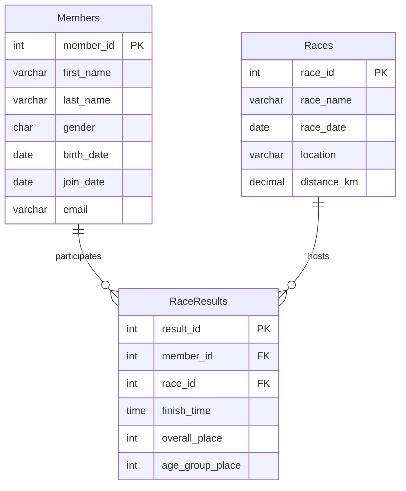

# CS415 Database Sample Project – Fall 2025 - Draft

---

## Database Summary Report (10 points)


### Describing the Organization

My Organization is called The Greenwood Roade Runners and they are a racing club based in Greenwood, Indiana. They were founded in 2019 and the club currently has 60 active members which range from ages 23 to 60. As of right now the club participates in 20-25 organized races per year. Two of which we host which are the Turkey Trot 5k and the Spring Classic Half Marathon. The President of the club, race director,Membership coordinators, and volunteer timers will handle all the planning, registration and keeping the records in the database. Our mission as an organization is to promote Health and pushing yourself 1% better everyday. Our Modo is Go One More, which incourages everyone to push past their limits to sucseed. We are inclusive so anyone, any age can join. We still celebrate competetive success through different age groups and club records. This database can give you the average 5k time for runners in their 30's or even top 10 5k times. while also looking back at ones history in races and seeing how much they have improved.

### Users Perspective

From a Users point of view, this database is a single source for everything related to the Club, whether racing or registration. Members and staff can pull up an alphabetical member dirrectory instantly and see every race that has been completed. This will have everything the club has entered including dates, locations, and distances. Also including ones indivitual time, overall place and age group. In one of my quiries Emily Johnson can run it and it will output her race history in chronological order. Another query you can is the 5k leaderboard, so that you can see how fast you need to run in order to make it up their.

Staff will use the database daily. Some examples include the Membership coordinators, Timers, and President. The Membership coordinators can identify members who have not attempted a half marathon and encourage those to compete. While the Timers take a look at it after every event and can determine whose ran the fastedt out of a specific year to crown the fastest. They can also crown who has ran the fastest 5k fro the year. The President could track what months have the highest sign up rate in order to determine when to schedule new races. if an error is made in the timing portion and it says you ran 20 seconds too slow, thats no problem. A single UPDATE statment can correct that and fix your time. If A runner gets injured after being added to a race the ROLLBACK call can undo their entry.


---

### Database ER Model (40 points)




-- prj3-queries.sql
-- Dylan Neese
-- CS415 Final Project - 10 Required Queries with Results

-- 1. Alphabetical member list

```sql

SELECT member_id, first_name, last_name, email FROM Members ORDER BY last_name, first_name LIMIT 10;

```

-- Returns 10 members: Adams → Clark

-- 2. Fastest pace per km

```sql

SELECT m.first_name, m.last_name, r.race_name, rr.finish_time,
       ROUND(TIME_TO_SEC(rr.finish_time)/60/r.distance_km,2) AS pace_min_per_km
FROM RaceResults rr JOIN Members m ON rr.member_id=m.member_id
JOIN Races r ON rr.race_id=r.race_id
ORDER BY pace_min_per_km LIMIT 8;

```

-- Liam Garcia: 3.84 min/km

-- 3. Races per month

```sql

SELECT MONTHNAME(race_date) AS month, COUNT(*) AS races_held
FROM Races GROUP BY month, MONTH(race_date) ORDER BY races_held DESC;

```

-- 4. Avg 5K time by age group

```sql

SELECT FLOOR((YEAR(r.race_date)-YEAR(m.birth_date))/10)*10 AS age_group,
       COUNT(*) AS runners,
       SEC_TO_TIME(AVG(TIME_TO_SEC(rr.finish_time))) AS avg_5k_time
FROM RaceResults rr JOIN Members m ON rr.member_id=m.member_id
JOIN Races r ON rr.race_id=r.race_id
WHERE r.distance_km=5.00 GROUP BY age_group HAVING runners>=5 ORDER BY avg_5k_time;

```
-- 5. Emma Johnson race history

```sql

SELECT m.first_name, m.last_name, r.race_name, r.race_date, r.distance_km,
       rr.finish_time, rr.overall_place
FROM Members m JOIN RaceResults rr ON m.member_id=rr.member_id
JOIN Races r ON rr.race_id=r.race_id
WHERE m.member_id=1 ORDER BY r.race_date DESC;

```

-- 6. Members who never ran a half marathon

```sql
SELECT m.member_id, m.first_name, m.last_name, m.join_date
FROM Members m LEFT JOIN RaceResults rr ON m.member_id=rr.member_id AND rr.race_id IN (7,17)
WHERE rr.member_id IS NULL ORDER BY m.last_name, m.first_name LIMIT 15;

```

-- 7. Fix Liam Garcia's winning time

```sql

UPDATE RaceResults SET finish_time='00:18:55', overall_place=1, age_group_place=1
WHERE member_id=2 AND race_id=1;

```

-- 8. Remove bad data

```sql
DELETE FROM RaceResults WHERE race_id=3 AND member_id IN (23,34);
```

-- 9. 5K leaderboard view

```sql

CREATE OR REPLACE VIEW v_5k_leaderboard AS
SELECT m.member_id, m.first_name, m.last_name, MIN(rr.finish_time) AS best_5k_time
FROM RaceResults rr JOIN Races r ON rr.race_id=r.race_id
JOIN Members m ON rr.member_id=m.member_id
WHERE r.distance_km=5.00 GROUP BY m.member_id ORDER BY best_5k_time;

SELECT * FROM v_5k_leaderboard LIMIT 10;

```

-- 10. Transaction with ROLLBACK

```sql
START TRANSACTION;
INSERT INTO RaceResults (member_id,race_id,finish_time) VALUES
(5,3,'00:00:00'),(12,3,'00:00:00'),(23,3,'00:00:00'),
(34,3,'00:00:00'),(45,3,'00:00:00'),(56,3,'00:00:00');
ROLLBACK;
       
SELECT COUNT(*) FROM RaceResults WHERE race_id=3 AND member_id IN (5,12,23,34,45,56);

```
```
-- Returns 0

